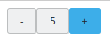
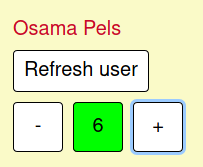

# lab-elm

A presentation (in French) about Elm.

## Generate the presentation

You'll need pandoc to compile the sources to html.

Then, open a terminal and run :
```bash
npm install
npm run build
```

## Projects

Go in one of the projects, then
```bash
npm install
npm run dev
```

### Results 

#### Hello world



#### Live Coding

